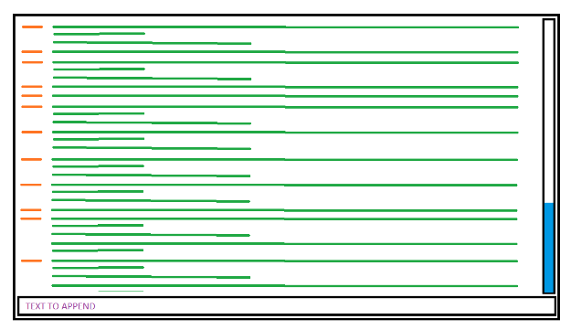

# React Chatbox Demo

- goal : create a chatbox who display client/user messages
- stack : react+typescript
- additionnal stack : vite+react-infinite-scroll-component+uuid+playwright

## Todo

- [x] logic: isolate chatbox by user and client ids
- [x] logic: faking client incom message with https://jsonplaceholder.typicode.com/
- [x] logic: faking database api with localStorage
- [x] logic: lazy load previous messages
- [x] logic: load range of messages on init
- [x] logic: load range of messages on scroll to top
- [ ] logic: redux store for messages notifications
- [ ] perf: optimize react-infinite-scroll-component (greedy layout shift)
- [x] test: e2e
- [x] ux: basic css
- [x] ux: basic ui
- [x] ux: basic fallback
- [x] ux: adapt css for major browser
- [ ] ux: chatbox fallbacks/transitions/animations
- [ ] ux: button scroll down on new incom message
- [ ] ux: scroll down on chatbox focus
- [ ] ux: add https://ant.design/ library

## Folders structure

- ref : https://www.robinwieruch.de/react-folder-structure/

## Scripts

look at package.json file for all scripts.

### Run Demo

```sh
npm install
```

```sh
npm run preview
```

### Type-Check, Compile and Minify for Production

```sh
npm run build
```

### Compile and Hot-Reload for Development

```sh
npm run dev
```

## Constraints (in french)



- Ajouter un message (depuis l’input avec le texte en violet) qui s’affiche en bas de la zone. Il devra toujours être le dernier élément visible.
- Récupérer l’historique des messages en lazy loading (sous forme de pagination infinie) lors du scroll top (curseur en bleu)
- A l’initialisation, la page 1 contenant les premiers messages seront placés dans la zone d’affichage
- La hauteur du contenu (en vert) peut varier et sera précédée de la date d’insertion (en orange)
- Optimiser le rendu, pour n’avoir que les messages affichés dans le DOM.
- L’app doit être en Reactjs
- Partir du principe que la pagination se fait sous forme de promise pour simuler un appel api, et peut soit être une donnée en dure, soit via un générateur.
- Les messages pourront être stockés dans un store.
- Utilisation de libs externes.
- Il n’y a pas de notions d’utilisateurs / websocket ou autres dépendances.
